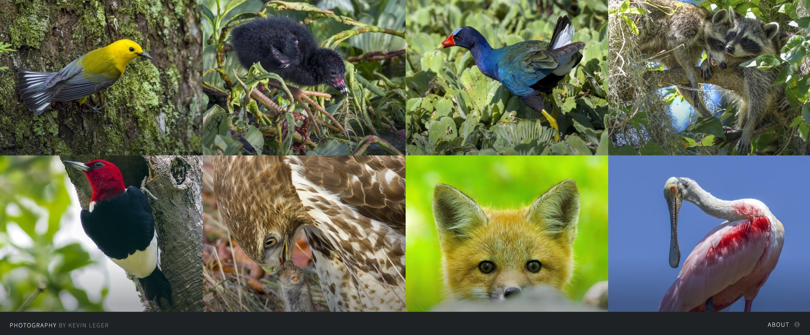

# Website Hosting in AWS - ft. Photography by Kevin Leger
This repository contains blueprints to build robust static website hosting architectures in AWS with features such as continuous delivery, accelerated content delivery, a contact form backend, and more.

To get started, review the architecture overview to decide on what features to implement then follow the deep dive guide or launch the appropriate CloudFormation template.

Visit [kevinleger.com](https://kevinleger.com) to check out a live example.

## Architecture Overview
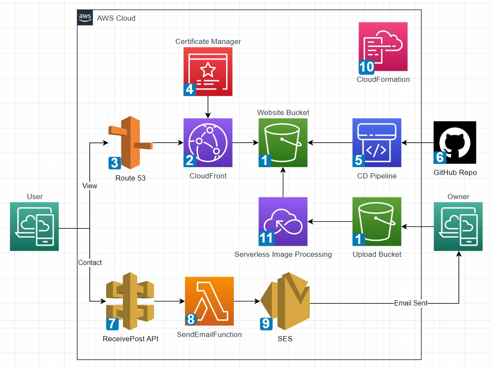

### Architecture Descriptions ([link to AWS docs](https://docs.aws.amazon.com/))

1. **Simple Storage Service (S3)** is an object storage service that offers industry-leading scalability, data availability, security, and performance. You can use Amazon S3 to store and retrieve any amount of data at any time, from anywhere.

2. **CloudFront** is a content delivery network (CDN) that accelerates delivery of static and dynamic web content to end users.

3. **Route 53** is a highly available and scalable Domain Name System (DNS) web service. You can use Route 53 to perform three main functions in any combination: domain registration, DNS routing, and health checking.

4. **Certificate Manager (ACM)** is a service that lets you easily provision, manage, and deploy public and private Secure Sockets Layer/Transport Layer Security (SSL/TLS) certificates for use with AWS services and your internal connected resources.

5. **CodePipeline** is a continuous delivery service you can use to model, visualize, and automate the steps required to release your software.

6. **GitHub** is a platform offering free and paid products for storing and collaborating on code.

7. **API Gateway** is a fully managed service that makes it easy for developers to create, publish, maintain, monitor, and secure APIs at any scale. 

8. **Lambda** is a serverless, event-driven compute service that lets you run code for virtually any type of application or backend service without provisioning or managing servers.

9. **Simple Email Service (SES)** is a cloud email service provider that can integrate into any application for bulk email sending. 

10. **CloudFormation** is a service that helps you model and set up your AWS resources so that you can spend less time managing those resources and more time focusing on your applications that run in AWS.

11. **Serverless Image Processing** is an event driven architecture written in python to transform uploaded images into thumbnails (using machine learning service Rekognition) and fullsize images with watermarks. Check out the project [here](https://github.com/levicherrin/aws-serverless-image-processing).

## Quick Deploy
If you're already familiar with AWS and the services used in this project then the fastest way to get up and running is to deploy one of three cloudformation templates.

Phase 1 requires a static website `index.html` file.

Phase 2 requires a github repository in addition to previous phase requirements.

Phase 3 requires a registered custom domain name and a Route53 public hosted zone in addition to previous phase requirements.

## Implementation Deep Dive

TODOS:
- add logging to cloudfront distribution? might add central logging bucket for all services
- need artifact bucket policy and edit web bucket policy for pipeline?
- verify what `select extract before deploy` does
- add info about linking r53 name servers to external registered domain
- check if IPv6 dns records are obsolete
- add 'why should i' statements for each phase to explain new capabilities gained
- review IAM policy permisions for SES
- review any best practices SES configuration

### Phase1

### Prerequisites

1. 'index.html' document and any supporting assets for your website

### S3 Bucket
Create a bucket in S3 with all default settings applied and upload the website files.

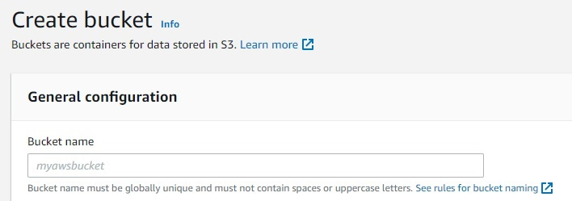

### CloudFront
Create a cloudfront distribution and set the distribution origin domain to point to the S3 bucket.
- Add an origin Access Control Identity (OAC) using the distribution wizard
- Set the viewer protocol to `redirect http to https`
- Choose the price class that aligns with your budget and expected end user locations
- Set the default root object to `index.html`

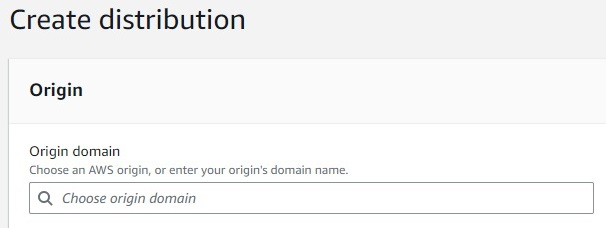

### S3 Bucket Policy
Edit the bucket policy and define permissions which allow access from a cloudfront origin access control identity.

**NOTE**: Replace any 'my' statements with the actual values specific to your deployment (e.g., `arn:aws:s3:::MY-BUCKET-NAME/* -> arn:aws:s3:::static-website-123/*`)


```
{
    "Version": "2012-10-17",
    "Statement": [
        {
            "Effect": "Allow",
            "Principal": {
                "Service": "cloudfront.amazonaws.com"
            },
            "Action": "s3:GetObject",
            "Resource": "arn:aws:s3:::MY-BUCKET-NAME/*"
            },
            "Condition": {
                "StringEquals": {
                    "AWS:SourceArn": "arn:aws:cloudfront::MY-ACCOUNT-ID:distribution/MY-DISTRIBUTION-ID"
                }
            }
        }
    ]
}
```

Now the website can be accessed via HTTPS with the cloudfront distribution domain name which is located on the details section of the distribution and looks like `hj34l2kdfks.cloudfront.net`.

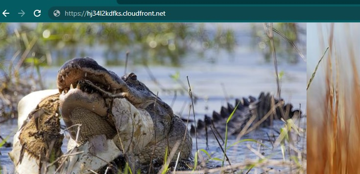

### Phase2

### Prerequisites

1. Completed previous phase(s)

2. A registered custom domain name

3. A Route53 public hosted zone with name servers configured for the domain name

### ACM
Request a public certificate through Certificate Manager with a wildcard subdomain set as the domain name and the root domain as an additional domain. This setup will allow use of this one public certificate with multiple subdomains such as `www.example.com` and `blog.example.com` in addition to the root domain `example.com`.

The wildcard subdomain should read as `*.example.com` where the example.com portion is replaced with your custom domain name.

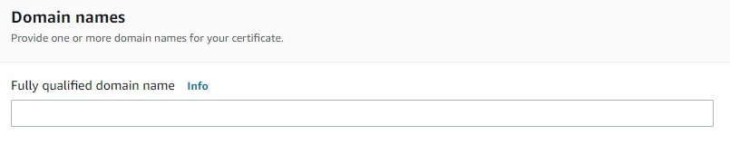

**Note**: the CNAME data provided by the ACM console is required for creating DNS records in Route53 to issue the certificate.

### Route53
Create DNS entries to route traffic from the custom domain to the cloudfront distribution and validate the ACM certificate.

- A and AAAA alias records for the apex domain routing traffic to the cloudfront distribution domain name
- A and AAAA alias records for the any subdomains routing traffic to the cloudfront distribution domain name
- CNAME record(s) for ACM certificate validation

### CloudFront
Edit the distribution general setting's alternate domain name field adding the custom root domain and subdomains associated with the public ACM certificate. Select the public certificate issued by ACM in the Custom SSL certificate field and save changes.


The website is now accessible from the custom domain via HTTPS.

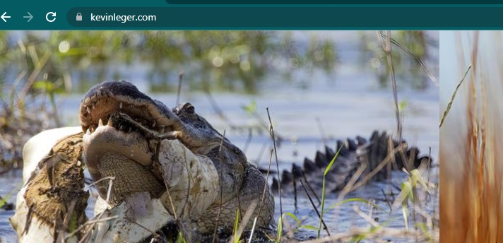


### Phase3

### Prerequisites

1. Completed phase1

2. Github account

3. A repository on the Github account storing the website files that were previously stored in the website S3 bucket

### S3 Bucket
Create a new s3 bucket with default settings to contain the artifacts created by CodePipeline.


### CodePipeline
First, create a new IAM policy defining permissions for this use case keeping least priviledge in mind. 

```
{
    "Version": "2012-10-17",
    "Statement": [
        {
            "Action": [
                "codestar-connections:UseConnection"
            ],
            "Resource": "arn:aws:codestar-connections:us-east-1:MY-ACCOUNT-ID:connection/MY-CONNECTION-ID",
            "Effect": "Allow"
        },
        {
            "Action": [
                "s3:PutObject"
            ],
            "Resource": [
                "arn:aws:s3:::MY-WEBSITE-BUCKET-NAME/*",
                "arn:aws:s3:::MY-ARTIFACT-BUCKET-NAME/*"
            ],
            "Effect": "Allow"
        },
        {
            "Action": [
                "s3:GetObject"
            ],
            "Resource": "arn:aws:s3:::MY-ARTIFACT-BUCKET-NAME/*",
            "Effect": "Allow"
        }
    ]
}
```
Next, create a role defining CodePipeline as the trusted entity and attach the policy to this role.

```
{
    "Version": "2012-10-17",
    "Statement": [
        {
            "Effect": "Allow",
            "Principal": {
                "Service": [
                    "codepipeline.amazonaws.com"
                ]
            },
            "Action": [
                "sts:AssumeRole"
            ]
        }
    ]
}
```

Create a new pipeline selecting the artifact bucket for the artifact store (under advanced settings) and select the new role to provide permissions for this pipeline to funcion properly.


Source Stage - Set the source as GitHub (Version 2) which will require integrating AWS connector as a GitHub app with your GitHub account/repository. This is a simple process that the setup wizard will walk you through to authorize aws connector. After the connection is made, select your repository name and branch name where the website files are stored while keeping other settings as default in the source stage settings.

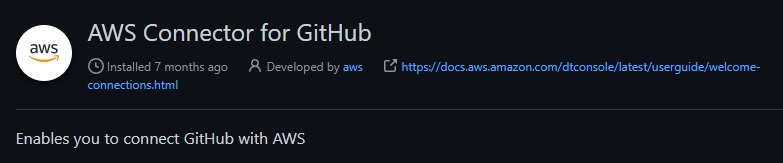

Build Stage - Skip. 

Deploy Stage - Select S3 for the deploy stage provider and the website bucket for the deploy location. Select extract before deploy and keep other settings as default.

Now changes made in the GitHub repository will flow to the website S3 Bucket automatically.

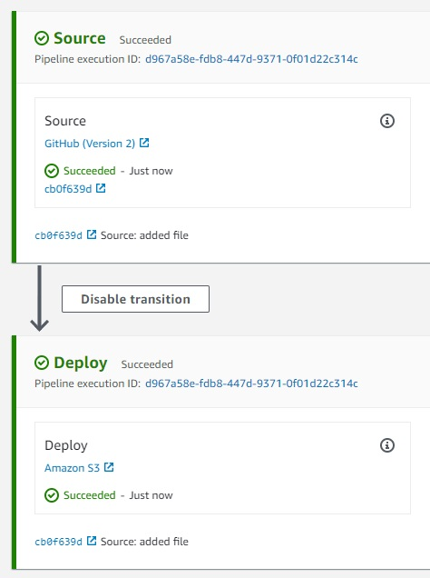

### Phase4

### Prerequisites

1. Completed Phase1

2. A contact form integrated with your website

3. Optional: completed Phase2 to use a custom domain with SES

### Simple Email Service

Verify the identites (domains or email addresses) that will be used to send emails or receive emails. This process is very simple for email addresses requiring clicking a link in an email to the address while domains require slightly more setup.

**Note**: A single email can be verified and used for sending and receiving emails to get started quickly.


### Lambda

Create a new IAM policy defining permissions that allows sending emails through SES. 

```
{
    "Version": "2012-10-17",
    "Statement": [
        {
            "Effect": "Allow",
            "Action": "ses:SendEmail",
            "Resource": "*"
        }
    ]
}
```
Next, create a role defining lambda as the trusted entity and attach the policy to this role.

```
{
    "Version": "2012-10-17",
    "Statement": [
        {
            "Effect": "Allow",
            "Principal": {
                "Service": "lambda.amazonaws.com"
            },
            "Action": "sts:AssumeRole"
        }
    ]
}
```

Create a new lambda function from scratch, name the function, select the latest python runtime (python 3.9 at this time), and expand 'change default execution role' then select the new role that provides SES permissions.

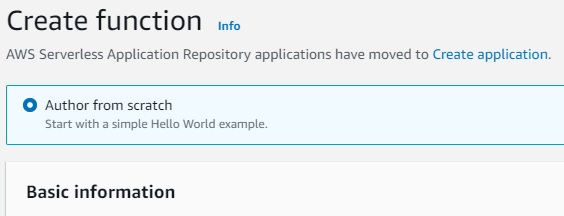

Replace the existing code source with the contactForm.py script (also shown below) and deploy the changes.

```
import json
import boto3
def lambda_handler(event, context):
    ses = boto3.client('ses')
    print(event['name'])
    body = 'Name : ' + event['name'] + '\n Email : ' + event['email'] + '\n Message : ' +event['desc']
    ses.send_email(
        Source = 'MY-SOURCE-EMAIL',
        Destination = {'ToAddresses': ['MY-DESTINATION-EMAIL']},
        Message = {'Subject':{
               'Data':'New Communication From MY-WEBSITE',
               'Charset':'UTF-8'
           },
           'Body':{
               'Text':{
                   'Data':body,
                   'Charset':'UTF-8'
               }
           }}
    )
    return{'statusCode': 200,'body': json.dumps('wohoo!, Email sent successfully')}
```
The function can be tested by configuring a test even with a JSON event like the following.

```
{
  "name": "value1",
  "email": "value2",
  "desc": "value3"
}
```
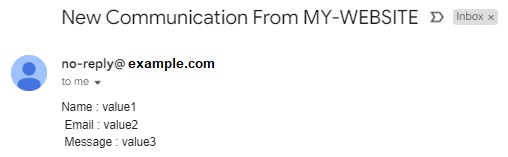

### API Gateway

Create a new REST API that will receive POST requests from the contact form then route the request to the lambda function.


Create a new API resource providing a name and selecting enable CORS.


Create a new method and select POST.

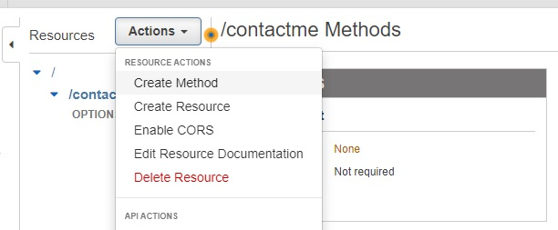

Finally deploy the API and create a new deployment stage.


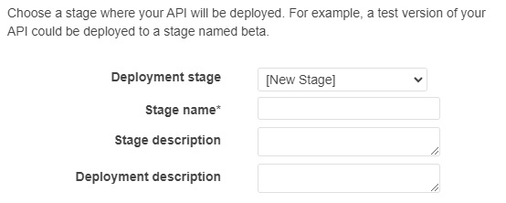

Copy the POST invoke url from the stages tab of the API and include the url in the website's contact form. The invoke url should be similar to `https://dfh341235s.execute-api.us-east-1.amazonaws.com/01/contactme`

The API can be tested using your website contact form or with the API gateway console by selecting the post method on the resources tab, clicking on test, and copying the same JSON used to test the Lambda Function into the request body.


## Credits
Thanks to [AJ](https://twitter.com/ajlkn) for the website template and [Ram](https://twitter.com/ram__patra) who enhanced it. Check out the website template on GitHub [here](https://github.com/rampatra/photography).