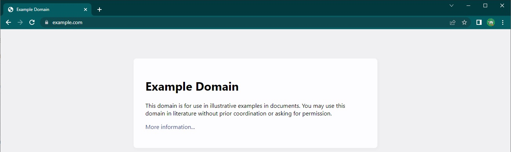
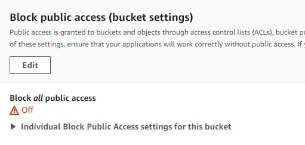
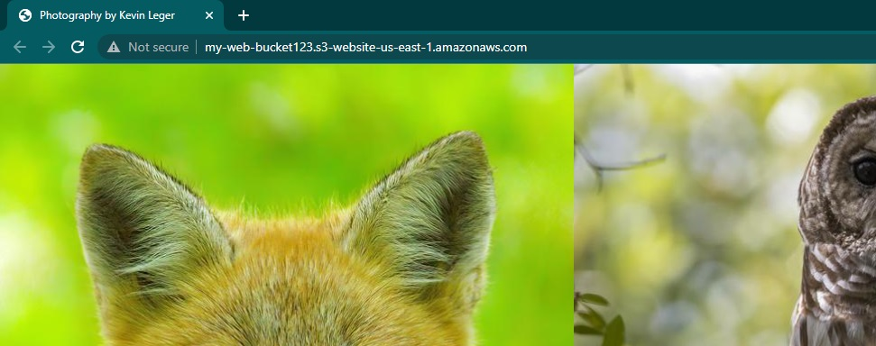

# Website Hosting in AWS
This repository contains walkthroughs and scripts for building robust static website hosting architectures in AWS with features such as:

- Custom domain integration
- Accelerated content delivery
- Serverless contact form backend
- Treating infrastructure as code (IaC)
- Continuous integration and deployment (CI/CD)

Visit [kevinleger.com](https://kevinleger.com) to check out the site used in the walkthroughs which runs using the techniques described herein.

## To-Do List:
- add authentication and authorization phase(s)
- add server-based hosting content
- review IAM policy permisions for SES
- review any best practices SES configuration
- align order of iam statements throughout
- review lambda proxy integration for contactForm

## Getting Started

There are two areas of instruction:
- The Basics - demonstrates how to start using services for this use case
    - walkthrough split into multiple sections called phases
    - plan to add dynamic website hosting with ec2/docker/etc. (date TBD)
- Deep Dives - goes beyond the basics and into more advanced topics
    - [cross-account CI/CD and IaC](docs/deepDives/pipeline/README.md) (work in progress)

## The Basics Architecture Overview
The complete architecture can be seen below and is broken down into phases to separate features from one another.

- Phase1: S3
- Phase2: CloudFront
- Phase3: ACM and R53
- Phase4: API GW, Lambda, and SES
- Phase5: GitHub and CodePipeline 

#### Service Descriptions
<!-- (TOC:collapse=true&collapseText=Click to expand) -->
<details>
<summary>(click to expand)</summary>

- **AWS Certificate Manager (ACM)** is a service that lets you easily provision, manage, and deploy public and private Secure Sockets Layer/Transport Layer Security (SSL/TLS) certificates for use with AWS services and your internal connected resources.

- **API Gateway** is a fully managed service that makes it easy for developers to create, publish, maintain, monitor, and secure APIs at any scale. 

- **CloudFormation** is a service that helps you model and set up your AWS resources so that you can spend less time managing those resources and more time focusing on your applications that run in AWS.

- **CloudFront** is a content delivery network (CDN) that accelerates delivery of static and dynamic web content to end users.

- **CodePipeline** is a continuous delivery service you can use to model, visualize, and automate the steps required to release your software.

- **Lambda** is a serverless, event-driven compute service that lets you run code for virtually any type of application or backend service without provisioning or managing servers.

- **Route 53** is a highly available and scalable Domain Name System (DNS) web service. You can use Route 53 to perform three main functions in any combination: domain registration, DNS routing, and health checking.

- **Simple Email Service (SES)** is a cloud email service provider that can integrate into any application for bulk email sending. 

- **Simple Storage Service (S3)** is an object storage service that offers industry-leading scalability, data availability, security, and performance. You can use Amazon S3 to store and retrieve any amount of data at any time, from anywhere.

</details>


## The Basics Walkthrough
This section will cover the implementation of each phase in enough detail for anyone following along and getting their hands dirty.

Every button click or keystroke to accomplish a task will not be captured as the AWS console UI and AWS services change overtime. However, links to the appropriate AWS documentation and other useful content will be captured in the resources section.

**NOTE**: Throughout each phase there are `my statements` which are placeholder values that must be replaced by the actual values specific to your deployment. Example below:

`arn:aws:s3:::MY-BUCKET-NAME/*` ------SHOULD BE CHANGED TO------> `arn:aws:s3:::cool-website-123/*`

## Phase1 - Getting up and Running ([CFN Template](cloudformation/phase1.json))
Why: Quickly deploy a website with an unencrypted connection via HTTP

What:
1. AWS account and IAM user with administrative permissions

2. index document and any supporting assets for a website

Resources:
- [Some free website templates](https://html5up.net/)
- [AWS account getting started](https://docs.aws.amazon.com/accounts/latest/reference/welcome-first-time-user.html)
- [AWS management console](https://docs.aws.amazon.com/awsconsolehelpdocs/latest/gsg/learn-whats-new.html)
- [S3 Documentation](https://docs.aws.amazon.com/AmazonS3/latest/userguide/Welcome.html)
- [Configuring an index document](https://docs.aws.amazon.com/AmazonS3/latest/userguide/IndexDocumentSupport.html)

### Step 1 - Website Bucket
Begin by creating a new bucket in S3 with all the default settings applied and upload the website files to the bucket.


Now we need to adjust the permissions so that anyone can view the files in the bucket.

First, navigate to the permissions tab of the bucket and turn off `block all public access`.




Next, edit the bucket policy to allow any principal (symbolized by the asterik) to read objects from the bucket using the S3 `GetObject` action.

```
{
    "Version": "2012-10-17",
    "Statement": [
        {
            "Sid": "PublicReadGetObject",
            "Effect": "Allow",
            "Principal": "*",
            "Action": "s3:GetObject",
            "Resource": "arn:aws:s3:::MY-BUCKET-NAME/*"
        }
    ]
}
```

Finally, navigate to the poperties tab and enable static website hosting. Make sure to specify the name of the website's index document which is commonly referred to as `index.html`. 

Click on the bucket website endpoint to access the site via HTTP in a new tab. 



## Phase2 - Encryption and Caching ([CFN Template](cloudformation/phase2.json))
Why: Encrypted connection via HTTPS, accelerated content delivery, origin behavior, and more

What: 
1. Completed Phase1

Resources:
- [CloudFront docs](https://docs.aws.amazon.com/AmazonCloudFront/latest/DeveloperGuide/Introduction.html)
- [S3 endpoint differences](https://docs.aws.amazon.com/AmazonS3/latest/userguide/WebsiteEndpoints.html#WebsiteRestEndpointDiff)

### Step 1 - Website Bucket
First, disable static website hosting on the bucket since CloudFront will be setup to use the bucket's REST API endpoint.

### Step 2 - CloudFront
Create a new CloudFront distribution and set:
- Distribution `origin domain` to the REST API endpoint of the bucket
- Add an `Origin Access Control (OAC)` identity using the distribution wizard
    - Opt to manually add permissions to the S3 bucket
- Set the viewer protocol to `redirect http to https`
- Choose the price class that aligns with your budget and expected end user locations
- Enter the default root object for the website such as `index.html`


### Step 3 - Website Bucket
Return to the website bucket then navigate to the permissions tab and turn `block all public access` back on. 

Then edit the bucket policy to redefine the permissions to allow access from the cloudfront OAC identity.

```
{
    "Version": "2012-10-17",
    "Statement": [
        {
            "Effect": "Allow",
            "Principal": {
                "Service": "cloudfront.amazonaws.com"
            },
            "Action": "s3:GetObject",
            "Resource": "arn:aws:s3:::MY-BUCKET-NAME/*",
            "Condition": {
                "StringEquals": {
                    "AWS:SourceArn": "arn:aws:cloudfront::MY-ACCOUNT-ID:distribution/MY-DISTRIBUTION-ID"
                }
            }
        }
    ]
}
```

Access the website via HTTPS with the cloudfront distribution domain name which is located on the details section of the distribution and looks similar to: `hj34l2kdfks.cloudfront.net`


## Phase3 - Custom Domain Name ([CFN Template](cloudformation/phase3.json))
Why: more intuitive URLs for users to interact with, branding, and other capabilities with Route 53

What:
1. Completed phase2
2. A registered custom domain name
3. A Route53 public hosted zone configured for the custom domain name

Resources:
- [Registering and managing domains](https://docs.aws.amazon.com/Route53/latest/DeveloperGuide/registrar.html)
- [AWS certificate manager docs](https://docs.aws.amazon.com/acm/latest/userguide/acm-overview.html)
- [Route 53 docs](https://docs.aws.amazon.com/Route53/latest/DeveloperGuide/Welcome.html)
- [CloudFront docs](https://docs.aws.amazon.com/AmazonCloudFront/latest/DeveloperGuide/Introduction.html)


### Step 1 - ACM
First, request a new public SSL/TLS certificate entering 
- domain name field set to a wildcard subdomain (e.g., `*.example.com`)
- then add another domain name this time entering the root domain (e.g., `example.com`)


This setup allows one certificate to protect multiple subdomains such as `www.example.com` and `blog.example.com` in addition to the root domain `example.com`.

Keep all other settings default and complete the certificate request.

**Note**: The step above assumes the access and ability to modify DNS records to validate the request

Navigate to the certificate details page to see that the issuing status is pending validation. Note down the CNAME name and value data provided for each domain which will be used to validate the request finalizing the issuing process.

### Step 2 - Route53
Create DNS records to validate the ACM certificate
- CNAME record for each domain listed on the ACM certificate using values from the ACM console

Create DNS records to route traffic to the cloudfront distribution domain name
- A alias record for the root domain 
- AAAA alias record for the root domain (if IPv6 is enabled for the CF distribution)
- Repeat the steps above for any subdomains

### Step 3 - CloudFront
Once the ACM certificate moves from pending to issued, edit the CF distribution general settings 
- add the root domain to the alternate domain name field 
- repeat the step above for any subdomains
- Select the public certificate issued by ACM in the Custom SSL certificate field


The website is now accessible from the custom domain via HTTPS


## Phase4 - Contact Form ([CFN Template](cloudformation/phase4.json))
Why: capability for users to contact an admin or website owner via a designated email address 

What:
1. Completed phase1
2. Contact form with a HTTP POST request integrated with the website
3. Optional: completed Phase3 to use a custom domain with SES

Resources:
- [SES docs](https://docs.aws.amazon.com/ses/latest/dg/Welcome.html)
- [Lambda docs](https://docs.aws.amazon.com/lambda/latest/dg/welcome.html)
- [API Gateway docs](https://docs.aws.amazon.com/apigateway/latest/developerguide/welcome.html)
- [Saurabh's blog post](https://aws.amazon.com/blogs/architecture/create-dynamic-contact-forms-for-s3-static-websites-using-aws-lambda-amazon-api-gateway-and-amazon-ses/)
- [Dinesh's blog post](https://medium.com/@dineshrk/contact-form-for-a-static-website-hosted-on-aws-s3-8033cfe027c0)

### Step 1 - Simple Email Service
To get started, create a new identity in SES for each sender and receiver that will be used to exchange email. 


**Note**: A single verified email address identity can be used as both the sending address and the receiving adress. This is a quick method to get running but may trigger spam/warning filters.

Once created, the identity will enter a `verification pending` status awaiting DNS records for Domains or clicking a verification link for emails. 


### Step 2 - IAM
Next, define a new IAM policy for Lambda with permissions that allow sending emails via SES. 

```
{
    "Version": "2012-10-17",
    "Statement": [
        {
            "Effect": "Allow",
            "Action": "ses:SendEmail",
            "Resource": "*"
        }
    ]
}
```
Next, create a role for lambda to assume during execution and attach the policy to this role.

```
{
    "Version": "2012-10-17",
    "Statement": [
        {
            "Effect": "Allow",
            "Principal": {
                "Service": "lambda.amazonaws.com"
            },
            "Action": "sts:AssumeRole"
        }
    ]
}
```
### Step 3 - Lambda
Author a new lambda function from scratch
- name the function
- select the latest python runtime (python 3.9 at this time)
- expand 'change default execution role' then select the newly created role.


Once created, replace the existing code source with the contactForm.py script (also shown below) and deploy the changes.

```
import json
import boto3

def lambda_handler(event, context):
    ses = boto3.client('ses')
    print(event['name'])
    body = 'Name : ' + event['name'] + '\n Email : ' + event['email'] + '\n Message : ' +event['desc']
    ses.send_email(
        Source = 'MY-SOURCE-EMAIL',
        Destination = {'ToAddresses': ['MY-DESTINATION-EMAIL']},
        Message = {'Subject':{
               'Data':'New Communication From MY-WEBSITE',
               'Charset':'UTF-8'
            },
           'Body':{
               'Text':{
                   'Data':body,
                   'Charset':'UTF-8'
               }
           }
        }   
    )
    return{'statusCode': 200,'body': json.dumps('wohoo!, Email sent successfully')}
```
Test the Lambda function by configuring a test event replacing the event JSON with the following:

```
{
  "name": "value1",
  "email": "value2",
  "desc": "value3"
}
```

A successful test will return a message in the console and send the email.


### Step 4 - API Gateway

Now all that is left is to connect the website to the Lambda function. Create a new REST API that will receive POST requests from the contact form then route the request to the lambda function.


Next, build out the API by clicking actions and:
- Create a new API resource and select enable CORS
- Create a new method and select POST
    - Leave the integration type as Lambda and enter the function name/ARN

**NOTE**: If CORS is not enabled then the contact form will not work!

Now similar to Lambda, the API can be tested in the management console
- Select the resources tab
- Select the post method
- click on test or the lightning bolt right below
- Copy the same JSON event used to test the Lambda Function into the request body.


With the API created, click actions and deploy the API. Then navigate to the stages tab, expand the new stage, and select the POST method.


Finally, copy the POST invoke url and include the url in the website's contact form script. The invoke url should look similar to `https://dfh341235s.execute-api.us-east-1.amazonaws.com/01/contactme`


## Phase5 - Continuous Deployment and Version Control ([CFN Template](cloudformation/phase5.json))
Why: Automate deployment of website changes

What:

1. Completed phase1

2. GitHub account

    2a. Repository with the website files

Resources:
- [CodePipeline docs](https://docs.aws.amazon.com/codepipeline/latest/userguide/welcome.html)

### Step 1 - Artifact Bucket
Create a new s3 bucket with default settings to contain the artifacts created by CodePipeline.


### Step 2 - CodePipeline
Navigate to the settings section of the CodePipeline console to create a new connection to GitHub. This will require signing into GitHub to integrate AWS connector as a GitHub app with your GitHub account/repository.


### Step 3 - IAM
Define a new IAM policy with the minimum permissions required for CodePipeline to transfer data from GitHub to S3. 

```
{
    "Version": "2012-10-17",
    "Statement": [
        {
            "Action": [
                "codestar-connections:UseConnection"
            ],
            "Resource": "arn:aws:codestar-connections:us-east-1:MY-ACCOUNT-ID:connection/MY-CONNECTION-ID",
            "Effect": "Allow"
        },
        {
            "Action": [
                "s3:PutObject"
            ],
            "Resource": [
                "arn:aws:s3:::MY-WEBSITE-BUCKET-NAME/*",
                "arn:aws:s3:::MY-ARTIFACT-BUCKET-NAME/*"
            ],
            "Effect": "Allow"
        },
        {
            "Action": [
                "s3:GetObject"
            ],
            "Resource": "arn:aws:s3:::MY-ARTIFACT-BUCKET-NAME/*",
            "Effect": "Allow"
        }
    ]
}
```
Next, create a role for CodePipeline to assume and attach the policy to this role.

```
{
    "Version": "2012-10-17",
    "Statement": [
        {
            "Effect": "Allow",
            "Principal": {
                "Service": [
                    "codepipeline.amazonaws.com"
                ]
            },
            "Action": [
                "sts:AssumeRole"
            ]
        }
    ]
}
```

### Step 4 - CodePipeline
Create a new pipeline 
- select the artifact bucket for the artifact store (under advanced settings)
- select the new role defined earlier 


Source Stage
- Set the action provider as GitHub (Version 2)
- Select the repository name and branch name where the website files are stored
- keep other settings as default

Build Stage 
- Skip

Deploy Stage
- Select S3 for the deploy stage provider
- Select the website bucket for the deploy location
- Select extract before deploy
- keep other settings as default

Now source code changes in the GitHub repository will flow to the website bucket in S3 automatically.


## Credits
Thanks to [AJ](https://twitter.com/ajlkn) and [Ram](https://twitter.com/ram__patra) for the [website template](https://github.com/rampatra/photography) used here.

Thanks to [Adrian](https://twitter.com/adriancantrill) for his AWS training and [this slack community](techstudyslack.slack.com) for help with anything AWS.