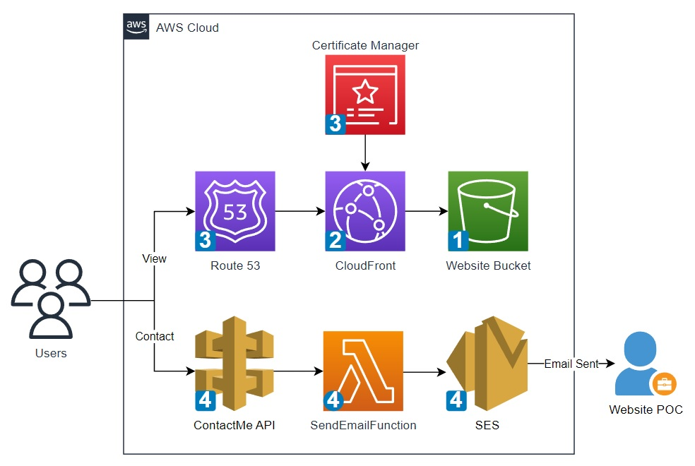

<!---
## To-Do List:
- add authentication and authorization phase
- review IAM policy permisions for SES
- review any best practices SES configuration
- align order of iam statements throughout
- review lambda proxy integration for contactForm
- add dynamic website hosting with containers (date TBD)
-->

# Website Hosting in AWS

This repository provides step-by-step guides for hosting simple websites on AWS (Amazon Web Services), aimed at helping newcomers get started with cloud hosting.

Here are the available guides:

* **[Static Website Hosting with S3](docs/staticWebsite/README.md):** Learn how to host a basic HTML, CSS, and JavaScript website using Amazon S3 for simple and cost-effective hosting.
* **[Dynamic Website Hosting with EC2 and a Web Server](docs/dynamicWebsite/README.md):** Explore how to host a dynamic website using an Amazon EC2 instance and a web server like Nginx or Apache.

Before proceeding, review the prerequisites in the [Getting Started](#getting-started) section and the architectural concepts in the [Architecture Overview](#architecture-overview).

## Getting Started:

Before diving into the details, make sure you have a few things ready:

1.  **An AWS Account:** If you don't already have one, you'll need to sign up for an AWS account. You can do this at the [AWS website](https://aws.amazon.com/). AWS offers a **free tier**, which should be sufficient for this project. **However, it's very important to review the terms and limitations of the free tier for each AWS service we use to ensure you don't incur any unexpected costs.**
2.  **A Text Editor:** You'll need a text editor to create and modify files. Popular options include VS Code, Sublime Text, or even Notepad (on Windows) or TextEdit (on macOS).
3.  **A Web Browser:** You'll need a web browser (like Chrome, Firefox, or Safari) to view your website.

**Important Cost Considerations:** As you work through this guide, you will be using various AWS services. To avoid incurring costs beyond the free tier, **it is essential to delete all the resources you create once you are finished with this project.**

## Architecture Overview

Here's a high-level overview of the hosting approaches covered in this repository:

### Static Website Hosting:

This approach uses Amazon S3 for storage and optionally Amazon CloudFront for content delivery. It is ideal for websites with static content like HTML, CSS, and JavaScript.

**Core AWS Services:**

- **Amazon Simple Storage Service (S3):** This service provides scalable object storage for the website files. It is configured to host the static website.
- **Amazon CloudFront:** This Content Delivery Network (CDN) accelerates the delivery of website content to users globally by caching it at edge locations. It improves website loading speed and can enhance security.
- **Amazon Route 53:** This scalable Domain Name System (DNS) web service manages the domain name and directs internet traffic to the website hosted on S3 or distributed via CloudFront.
- **AWS Certificate Manager (ACM):** This service provisions and manages SSL/TLS certificates, enabling secure HTTPS connections for the website, often used with CloudFront.

### Dynamic Website Hosting:

This approach involves running a dynamic website powered by **WordPress** on **Amazon Elastic Compute Cloud (EC2)** instances using the following technologies and AWS services:

- **WordPress:** The open-source content management system (CMS).
- **LAMP Stack:**
    - **Linux (RHEL):** The operating system on the EC2 instances.
    - **Apache:** The web server software.
    - **MySQL (via Amazon RDS):** The managed database service.
    - **PHP:** The scripting language.
- **Amazon Elastic Compute Cloud (EC2):** Virtual servers to run the application and web server with autoscaling.
- **Amazon Virtual Private Cloud (VPC):** Provides an isolated virtual network for enhanced security and high availability.
- **AWS Application Load Balancer (ALB):** To distribute traffic across multiple EC2 instances.
- **Amazon Relational Database Service (RDS) for MySQL:** To store the dynamic content.
- **Amazon CloudFront:** To cache content and improve performance.
- **Amazon Route 53:** To manage the domain name and direct traffic.

