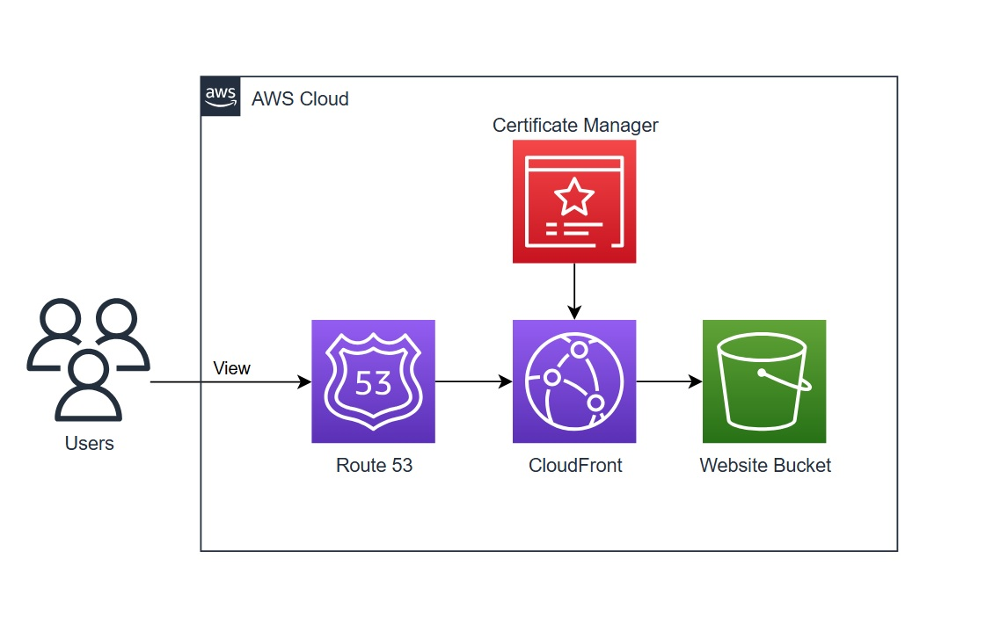

# Website Hosting in AWS
This repository contains walkthroughs / scripts for building web hosting architectures in AWS with features such as:

- Custom domain integration
- Accelerated content delivery
- Serverless contact form backend
- Treating infrastructure as code (IaC)
- Continuous integration and deployment (CI/CD)

Visit [kevinleger.com](https://kevinleger.com) to check out the site used in the walkthroughs which runs using the techniques described herein.

## To-Do List:
- add authentication and authorization phase
- review IAM policy permisions for SES
- review any best practices SES configuration
- align order of iam statements throughout
- review lambda proxy integration for contactForm
- add dynamic website hosting with containers (date TBD)

## Getting Started

There are two walkthroughs further down this page on how to:
- Host a static website with S3
- Host a dynamic website with EC2

Additional topics tailored for this use case are covered in the [docs](./docs/) directory:
- [AWS organization setup](./docs/organizations/) (work in progress)
- [IaC with terraform and cloudformation](./infrastructure/) (work in progress)
- [Continuous integration / deployment pipeline](docs/deepDives/pipeline/README.md) (work in progress)

## Static Website Architecture
Hosting a static web page is relatively simple and cost effiecient. These sites present the same information to all users and might be updated infrequently. For static pages that require more frequent updates, combine a static site generator like Hugo with a CI/CD pipeline to automate deploying changes.

The architecture can be seen below and is broken down into phases to separate features from one another.

- [Phase1: S3](#phase1---getting-up-and-running)
- [Phase2: CloudFront](#phase2---encryption-and-caching)
- [Phase3: ACM and R53](#phase3---custom-domain-name)
- [Phase4: API GW, Lambda, and SES](#phase4---contact-form)



#### Service Descriptions
<!-- (TOC:collapse=true&collapseText=Click to expand) -->
<details>
<summary>(click to expand)</summary>

- **AWS Certificate Manager (ACM)** is a service that lets you easily provision, manage, and deploy public and private Secure Sockets Layer/Transport Layer Security (SSL/TLS) certificates for use with AWS services and your internal connected resources.

- **API Gateway** is a fully managed service that makes it easy for developers to create, publish, maintain, monitor, and secure APIs at any scale. 

- **CloudFormation** is a service that helps you model and set up your AWS resources so that you can spend less time managing those resources and more time focusing on your applications that run in AWS.

- **CloudFront** is a content delivery network (CDN) that accelerates delivery of static and dynamic web content to end users.

- **CodePipeline** is a continuous delivery service you can use to model, visualize, and automate the steps required to release your software.

- **Lambda** is a serverless, event-driven compute service that lets you run code for virtually any type of application or backend service without provisioning or managing servers.

- **Route 53** is a highly available and scalable Domain Name System (DNS) web service. You can use Route 53 to perform three main functions in any combination: domain registration, DNS routing, and health checking.

- **Simple Email Service (SES)** is a cloud email service provider that can integrate into any application for bulk email sending. 

- **Simple Storage Service (S3)** is an object storage service that offers industry-leading scalability, data availability, security, and performance. You can use Amazon S3 to store and retrieve any amount of data at any time, from anywhere.

</details>

## Dynamic Website Architecture
To provide more rich features to users a web page needs to dynamically generate unique content upon request which requres a server. 
- WordPress is the open-source software used for the dynamic site
- LAMP stack is Red Hat Enterpise Linux, Apache, RDS MySQL, and PHP
- Connections to the WordPress servers are made through application load balancers
- Both the load balancers and EC2 instances autoscale across AZs
- Content is cached using CloudFront to reduce server load and accelerate delivery

The architecture can be seen below.


## Walkthroughs
Implementation of each phase should be covered in enough detail for anyone following along and getting their hands dirty, however, every click/keystroke to accomplish a task will not be captured as the AWS console UI and AWS services change overtime.

Links to the appropriate AWS documentation and other useful content will be captured in the resources area for each phase.

**NOTE**: Throughout each phase there are `my statements` which are placeholder values that must be replaced by the actual values specific to your deployment. Example below:

`arn:aws:s3:::MY-BUCKET-NAME/*` ------SHOULD BE CHANGED TO------> `arn:aws:s3:::cool-website-123/*`

## Static Website Walkthrough

### Phase1 - Getting up and Running
Why: Quickly deploy a website with an unencrypted connection via HTTP

What:
1. AWS account and IAM user with administrative permissions

2. index document and any supporting assets for a website

Resources:
- [Free website templates](https://html5up.net/)
- [AWS account getting started](https://docs.aws.amazon.com/accounts/latest/reference/welcome-first-time-user.html)
- [AWS management console](https://docs.aws.amazon.com/awsconsolehelpdocs/latest/gsg/learn-whats-new.html)
- [S3 Documentation](https://docs.aws.amazon.com/AmazonS3/latest/userguide/Welcome.html)
- [Configuring an index document](https://docs.aws.amazon.com/AmazonS3/latest/userguide/IndexDocumentSupport.html)

Begin by creating a new bucket in S3 with all the default settings applied and upload the website files to the bucket.


Now we need to adjust the permissions so that anyone can view the files in the bucket.

First, navigate to the permissions tab of the bucket and turn off `block all public access`.


Next, edit the bucket policy to allow any principal (symbolized by the asterik) to read objects from the bucket using the S3 `GetObject` action.

```
{
    "Version": "2012-10-17",
    "Statement": [
        {
            "Sid": "PublicReadGetObject",
            "Effect": "Allow",
            "Principal": "*",
            "Action": "s3:GetObject",
            "Resource": "arn:aws:s3:::MY-BUCKET-NAME/*"
        }
    ]
}
```

Finally, navigate to the poperties tab and enable static website hosting. Make sure to specify the name of the website's index document which is commonly referred to as `index.html`. 

Click on the bucket website endpoint to access the site via HTTP in a new tab. 


### Phase2 - Encryption and Caching
Why: Encrypted connection via HTTPS, accelerated content delivery, origin behavior, and more

What: 
1. Completed Phase1

Resources:
- [CloudFront docs](https://docs.aws.amazon.com/AmazonCloudFront/latest/DeveloperGuide/Introduction.html)
- [S3 endpoint differences](https://docs.aws.amazon.com/AmazonS3/latest/userguide/WebsiteEndpoints.html#WebsiteRestEndpointDiff)

First, disable static website hosting on the bucket since CloudFront will be setup to use the bucket's REST API endpoint.

Create a new CloudFront distribution and set:
- Distribution `origin domain` to the REST API endpoint of the bucket
- Add an `Origin Access Control (OAC)` identity using the distribution wizard
    - Opt to manually add permissions to the S3 bucket
- Set the viewer protocol to `redirect http to https`
- Choose the `price class` that aligns with your budget and expected end user locations
- Enter the `default root object` for the website such as `index.html`


Return to the website bucket then navigate to the permissions tab and turn `block all public access` back on. 

Then edit the bucket policy to redefine the permissions to allow access from the cloudfront OAC identity.

```
{
    "Version": "2012-10-17",
    "Statement": [
        {
            "Effect": "Allow",
            "Principal": {
                "Service": "cloudfront.amazonaws.com"
            },
            "Action": "s3:GetObject",
            "Resource": "arn:aws:s3:::MY-BUCKET-NAME/*",
            "Condition": {
                "StringEquals": {
                    "AWS:SourceArn": "arn:aws:cloudfront::MY-ACCOUNT-ID:distribution/MY-DISTRIBUTION-ID"
                }
            }
        }
    ]
}
```

Access the website via HTTPS with the cloudfront distribution domain name which is located on the details section of the distribution and looks similar to: `hj34l2kdfks.cloudfront.net`


### Phase3 - Custom Domain Name
Why: more intuitive URLs for users to interact with, branding, and other capabilities with Route 53

What:
1. Completed phase2
2. A registered custom domain name
3. A Route53 public hosted zone configured for the custom domain name

Resources:
- [Registering and managing domains](https://docs.aws.amazon.com/Route53/latest/DeveloperGuide/registrar.html)
- [AWS certificate manager docs](https://docs.aws.amazon.com/acm/latest/userguide/acm-overview.html)
- [Route 53 docs](https://docs.aws.amazon.com/Route53/latest/DeveloperGuide/Welcome.html)
- [CloudFront docs](https://docs.aws.amazon.com/AmazonCloudFront/latest/DeveloperGuide/Introduction.html)

First, request a new public SSL/TLS certificate entering 
- domain name field set to a wildcard subdomain (e.g., `*.example.com`)
- then add another domain name this time entering the root domain (e.g., `example.com`)


This setup allows one certificate to protect multiple subdomains such as `www.example.com` and `blog.example.com` in addition to the root domain `example.com`.

Keep all other settings default and complete the certificate request.

**Note**: The step above assumes the access and ability to modify DNS records to validate the request

Navigate to the certificate details page to see that the issuing status is pending validation. Note down the CNAME name and value data provided for each domain which will be used to validate the request finalizing the issuing process.

Create DNS records to validate the ACM certificate
- CNAME record for each domain listed on the ACM certificate using values from the ACM console

Create DNS records to route traffic to the cloudfront distribution domain name
- A alias record for the root domain 
- AAAA alias record for the root domain (if IPv6 is enabled for the CF distribution)
- Repeat the steps above for any subdomains

Once the ACM certificate moves from pending to issued, edit the CF distribution general settings 
- add the root domain to the alternate domain name field 
- repeat the step above for any subdomains
- Select the public certificate issued by ACM in the Custom SSL certificate field


The website is now accessible from the custom domain via HTTPS


Why: capability for users to contact an admin or website owner via a designated email address 

What:
1. Completed phase1
2. Contact form with a HTTP POST request integrated with the website
3. Optional: completed Phase3 to use a custom domain with SES

Resources:
- [SES docs](https://docs.aws.amazon.com/ses/latest/dg/Welcome.html)
- [Lambda docs](https://docs.aws.amazon.com/lambda/latest/dg/welcome.html)
- [API Gateway docs](https://docs.aws.amazon.com/apigateway/latest/developerguide/welcome.html)
- [Saurabh's blog post](https://aws.amazon.com/blogs/architecture/create-dynamic-contact-forms-for-s3-static-websites-using-aws-lambda-amazon-api-gateway-and-amazon-ses/)
- [Dinesh's blog post](https://medium.com/@dineshrk/contact-form-for-a-static-website-hosted-on-aws-s3-8033cfe027c0)

To get started, create a new identity in SES for each sender and receiver that will be used to exchange email. 


**Note**: A single verified email address identity can be used as both the sending address and the receiving adress. This is a quick method to get running but may trigger spam/warning filters.

Once created, the identity will enter a `verification pending` status awaiting DNS records for Domains or clicking a verification link for emails. 


Next, define a new IAM policy for Lambda with permissions that allow sending emails via SES. 

```
{
    "Version": "2012-10-17",
    "Statement": [
        {
            "Effect": "Allow",
            "Action": "ses:SendEmail",
            "Resource": "*"
        }
    ]
}
```
Next, create a role for lambda to assume during execution and attach the policy to this role.

```
{
    "Version": "2012-10-17",
    "Statement": [
        {
            "Effect": "Allow",
            "Principal": {
                "Service": "lambda.amazonaws.com"
            },
            "Action": "sts:AssumeRole"
        }
    ]
}
```
Author a new lambda function from scratch
- name the function
- select the latest python runtime (python 3.9 at this time)
- expand 'change default execution role' then select the newly created role.


Once created, replace the existing code source with the [contactForm.py script](lambda/contactForm.py) (also shown below) and deploy the changes.

```
import json
import boto3

def lambda_handler(event, context):
    ses = boto3.client('ses')
    print(event['name'])
    body = 'Name : ' + event['name'] + '\n Email : ' + event['email'] + '\n Message : ' +event['desc']
    ses.send_email(
        Source = 'MY-SOURCE-EMAIL',
        Destination = {'ToAddresses': ['MY-DESTINATION-EMAIL']},
        Message = {'Subject':{
               'Data':'New Communication From MY-WEBSITE',
               'Charset':'UTF-8'
            },
           'Body':{
               'Text':{
                   'Data':body,
                   'Charset':'UTF-8'
               }
           }
        }   
    )
    return{'statusCode': 200,'body': json.dumps('wohoo!, Email sent successfully')}
```
Test the Lambda function by configuring a test event replacing the event JSON with the following:

```
{
  "name": "value1",
  "email": "value2",
  "desc": "value3"
}
```

A successful test will return a message in the console and send the email.


Now all that is left is to connect the website to the Lambda function. Create a new REST API that will receive POST requests from the contact form then route the request to the lambda function.


Next, build out the API by clicking actions and:
- Create a new API resource and select enable CORS
- Create a new method and select POST
    - Leave the integration type as Lambda and enter the function name/ARN

**NOTE**: If CORS is not enabled then the contact form will not work!

Now similar to Lambda, the API can be tested in the management console
- Select the resources tab
- Select the post method
- click on test or the lightning bolt right below
- Copy the same JSON event used to test the Lambda Function into the request body.


With the API created, click actions and deploy the API. Then navigate to the stages tab, expand the new stage, and select the POST method.


Finally, copy the POST invoke url and include the url in the website's contact form script. The invoke url should look similar to `https://dfh341235s.execute-api.us-east-1.amazonaws.com/01/contactme`

## Dynamic Website Walkthrough (work in progress)

### Phase1 - EC2 and RDS Instances
First, deploy resources in the default VPC to access the website with an unencrypted connection via HTTP and create a launch template for later use.

Requirements:
1. AWS account and IAM user with administrative permissions

Resources:
- [AWS account getting started](https://docs.aws.amazon.com/accounts/latest/reference/welcome-first-time-user.html)
- [AWS management console](https://docs.aws.amazon.com/awsconsolehelpdocs/latest/gsg/learn-whats-new.html)


Launch a new EC2 instance with the Red Hat quickstart AMI.
- instance type t2.micro
- create a new key pair
- allow http traffice from the internet
- launch instance


Create a new RDS MySQL database for WordPress to connect to from the EC2 instance
- navigate to RDS
- create database
- easy create
- MySQL
- free tier
- db identifier change to wordpress
- password as password
- expand ec2 connection
- choose instance
- create database


<!-- + need to dowload to /tmp since ssm can't access ec2-user + -->

Return to the EC2 instance which should be up and running, copy the public IPv4 address, and ssh into the instance

Install the wp application and dependencies
- use mysql cli to access the db instance
- create the wp db
- edit wp-config.php adding database info
- run more bash commands

Now that the web server is up and running
- navigate back to ec2 management console
- copy the EC2 instance's public IPv4 address and paste it into a web browser
- make sure the browser is attempting the connection with http or else the connection to the server will fail
- greeted by wp install page


Access to the server and wordpress operation has been verified

<!-- + bash commands deleting /var/www content leaving /tmp content + -->
The storage volume of this instance will become part of a template later in a phase so a snapshot is required
- navigate back to ec2 management console
- elastic block store < volumes
- select the volume
- create snap
- add desc
- create


Now terminate both the EC2 instance and the RDS database as the next phase will create a new VPC to deploy resources to.

### Phase2 - Networking
The VPC and other resources created in this phase will allow for full control in defining the networking architecture required the application. Values such as CIDR ranges will be provided during the phase but feel free to diverge where needed.

Resources:
- [AWS account getting started](https://docs.aws.amazon.com/accounts/latest/reference/welcome-first-time-user.html)
- [AWS management console](https://docs.aws.amazon.com/awsconsolehelpdocs/latest/gsg/learn-whats-new.html)

Create a new VPC that is customized for this use case
- navigate to vpc console
- create vpc
- put wordpress for the name tag
- ipv4 cidr block 10.16.0.0/16
- leave other settings default


**TIP: The new resource map preview is helpful to visualize whats being created; check back to it as resources are created if there is any confusion**


Next, create the VPC subnets
- navigate to subnets > create subnet > select wordpress vpc
- create 9 subnets total

| name | az | cidr |
| --- | --- | --- |
| subn_web_a | us-east-1a | 10.16.0.0/20 |
| subn_app_a | us-east-1a | 10.16.16.0/20 |
| subn_data_a | us-east-1a | 10.16.32.0/20 |
| subn_web_b | us-east-1b | 10.16.48.0/20 |
| subn_app_b | us-east-1b | 10.16.64.0/20 |
| subn_data_b | us-east-1b | 10.16.80.0/20 |
| subn_web_c | us-east-1c | 10.16.96.0/20 |
| subn_app_c | us-east-1c | 10.16.112.0/20 |
| subn_data_c | us-east-1c | 10.16.128.0/20 |

The resource map should now look like this


The vpc has no internet connectivity for users to reach the wordpress server(s) so an internet gateway is needed
- navigate to igw > create
- wordpress-igw for name and create
- click actions > attach to vpc
- select wp vpc and click attach
- refresh vpc console and check resource map

The web subnets need a route table and routes to reach the igw
- navigate to route tables and create
- named public_rtb
- select wp vpc
- edit routes
- add
- 0.0.0.0/0 (anywhere)
- target igw
- save
- edit subn associations
- select each web sb
- save


The app subnets need egress only internet connectivity (nat gateway) to downlaod updates, plugins, etc.
- navigate vpc > natgw > create
- name wordpress_natgw
- pick web subnet a in new vpc
- allocate eip
- create

Create route table and routes from app subnets to natgw
- name egress_rtb
- pick vpc
- create
- subnet association
- pick app subnets
- save
- edit route > add
- dest = 0.0.0.0/0, target natgw
- save


### Phase3 - Load Balancing, Autoscaling, and RDS
With the new VPC and networking resources created, the EC2 instance and RDS database can be redeployed

First, create security groups so resources can comm in custom vpc


- name web_sg with rules:

| type | port | target |
| --- | --- | --- |
| inbound | 80 | 0.0.0.0/0 |
| outbound | 80 | app_sg |

- name app_sg with rules:

| type | port | target |
| --- | --- | --- |
| inbound | 80 | web_sg |
| outbound | 443 | 0.0.0.0/0 |
| outbound | 3306 | data_sg |

- name data_sg with rules:

| type | port | target |
| --- | --- | --- |
| inbound | 3306 | app_sg |

Before deploying a the database create a subnet group for the new VPC. RDS requires a subnet group incase the database is ever configured for Multi-AZ.
- navigate to rds > subnet groups > create
- name rds_subnets
- desc
- pick vpc
- pick a/b/c AZs
- pick data subnet ids
- create

Now create the RDS database
- standard
- mysql
- applicable tier (free tier for learning)
- wordpress db ident
- secure password #change to secrets manager
- don't auto setup ec2 connect
- select vpc
- select subnet group
- remove existing sgs and add data sg
- expand additonal config > initial db name as wordpress_db
- create


With the database deployed, the next focus will be the web server. The sever will no longer be provisioned manual and an auto scaling group (ASG) will be used instead. 

Two items are needed before the ASG is created:
- iam role
- launch template

The EC2 instance will need credentials to access Systems Manager for remote terminal sessions
- navigate to iam
- create role
- aws service
- ec2 use case (creates a trust policy)
- add AmazonSSMManagedInstanceCore policy
- name ssm_for_ec2
- create


The launch template will serve as the blueprint for the ASG to launch instances
- nav to ec2 > launch tempalate > create
- select snap that was made
- select iam role under advanced details > iam instance profile
- don't include subnet info
- pick app_sg


With the prereqs out of the way, create the ASG
- navigate ec2 > auto scaling groups
- create
- name wordpress_autoscaling
- pick lt
- version latest
- pick vpc
- pick app subnets
- set desired/min/max capacities (tip: for easy 1 instance failover use 1/1/1)
- create
<!-- + look into scaling policy + -->
<!-- + add refresh based on lt + -->


<!-- + need to update lt or take snap later or automate config + -->
Configure wp (add db info to wp-config)
- cant ssh directly in anymore unless a bastion host is setup
- can use ssm to access command line
- navigate ssm > fleet manager and wait for instance to show up
- when shows up node action > start terminal session
- run bash commands

With the ASG providing constant servers to run wp two things are needed: a static endpoint to access the wp servers and traffic distribution among the instances launched by the ASG. Load balancing solves both points and requires a target group

Create target grp
- ec2 > target grp > create
- name wordpress-target-grp
- confirm correct vpc
- health check path /wp-login.php
- expand adv hc settings > success codes 200,302
- next
- select instance and include
- create


The load balancer type will be an application load balancer for this deployment since SSL encrytion will be offloaded from the server and onto the load balancer and a SSL cert cannot be attached to a network load balancer.

Create load balancer 
- ec2 > load balancer > create
- alb
- name wordpress-lb
- pick vpc
- pick all three azs and the web subnets
- remove default sg and pick web sg
- pick target grp
- create


The wp site is now accessible via the alb dns endpoint


### Phase4 - Custom Domain and SSL
Next, a user friendly way to access the site will be implemented via a custom domain name and the connection between the two will be encrypted.

Requirements:
- registered domain name
- R53 hosted zone for domain

To make the site reachable via custom domain name, create a R53 alias record pointing to the load balancer endpoint
- navigate r53 > hosted zone > create record
- alias switched on
- route traffice to alb endpoint
- create


Now navigate to site from a browser with the custom domain using http
- double click in address bar to verify https is NOT used since its default
- wont resolve to site yet if https


The first step to encrypting the connection is to request a SSL certificate
- navigate to acm > request
- public cert
- fqdn as custom domain
- leave default and request
- create new CNAME record in r53 with the name/value provided in acm console
- wait for cert status to display issued


Edit wp if needed (wp config)
- nav to ssm fleet > node action > start terminal session
- vim config
- add https info

Now the load balancer listener needs to be configured to use https and have the SSL cert attached
- change inb sg rule from http to https
- pick http listener > actions > edit
- change protocol from http to https
- pick acm cert for default ssl/tls cert
- save


The site is now reachable from custom domain using https
- again check url or manually type https:// or the url won't resolve if its trying http still


### Phase5 - Content Delivery Network
This phase adds a content delivery netowrk to improve access speed for downloading the site's content and will also improve performance by reducing the amount of requests process by the web server.

First, create a cloudfront distribution and default behavior
- nav cf > create
- pick lb endpoint as origin domain
- name as wordpress
- viewer protocol policy redirect http to https
- allow all http methods and cache options method
- cache policy as managed cachingOptimized?
- origin request policy as custom? for header/cookies
- waf do not use
- alternate domain name (CNAME) as domain name
- custom ssl cert same as lb cert
- create


**NOTE**: The wp admin / login page may not function propery untill cf behaviors are added that pass all headers

Next, create any other required behaviors (these are specific to wp) for the site: 

| Property | Default | Admin | Login | Content | Includes
| --- | --- | --- | --- | --- | --- 
| paths | * | wp-admin/* | wp-login.php | wp-content/* | wp-includes/*
| protocols | HTTPS | HTTPS | HTTPS | HTTPS | HTTPS
| http methods | all | all | all | GET, HEAD | GET, HEAD
| http headers | some | all | all | none | none
| cookies | some | all | all | none | none
| query strings | yes | yes | yes | yes | yes


Now edit the R53 alias record to point to the cloudfront distribution endpoint instead of the load balancer endpoint
- alis to cf
- enter cf dns endpoint
- save


Now the domain is being served via cloudfront which can be seen in google chrome by
- right click web page for site in browser > inspect
- network tab
- refresh site
- click install.php
- view response headers


## Credits
Thanks to [AJ](https://twitter.com/ajlkn) and [Ram](https://twitter.com/ram__patra) for the awesome [static website template](https://github.com/rampatra/photography).

Thanks to [Adrian](https://twitter.com/adriancantrill) for his AWS training and the [techstudyslack](techstudyslack.slack.com) community for help with anything AWS.