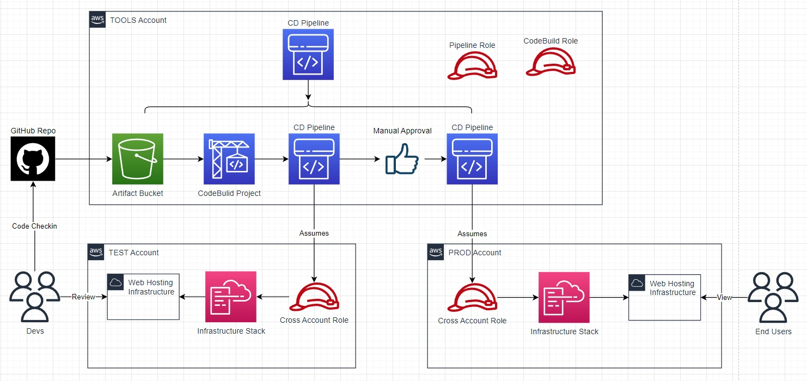

# Deep Dive - Cross-Account CI/CD Pipeline and IaC
This walkthrough will build off of The Basics by creating a pipeline for automated test and production enviorments.

## To-Do List:
- finalize architecture diagram
- automate account setup

## Architecture Overview
The pipeline operates across multiple accounts to create the web hosting infrastructure in one account for testing and review then another account for production use. Infrastructure deployments will be performed through CloudFormation with minimum management console interactions.

#### Service Descriptions
<!-- (TOC:collapse=true&collapseText=Click to expand) -->

(click to expand)

- **CloudFormation** is a service that helps you model and set up your AWS resources so that you can spend less time managing those resources and more time focusing on your applications that run in AWS.

- **CodeBuild** is a fully managed continuous integration service that compiles source code, runs tests, and produces ready-to-deploy software packages.

- **CodePipeline** is a continuous delivery service you can use to model, visualize, and automate the steps required to release your software.

- **Simple Storage Service (S3)** is an object storage service that offers industry-leading scalability, data availability, security, and performance. You can use Amazon S3 to store and retrieve any amount of data at any time, from anywhere.

## Walkthrough

**NOTE**: Throughout each phase there are `my statements` which are placeholder values that must be replaced by the actual values specific to your deployment. Example below:

`arn:aws:s3:::MY-BUCKET-NAME/*` ------SHOULD BE CHANGED TO------> `arn:aws:s3:::cool-website-123/*`

## Phase1 - Account Setup

What:
1. AWS management account and IAM user with administrative permissions

2. An organization created in the management account with DEV and PROD children accounts

3. A Route53 public hosted zone configured for a custom domain name in the PROD account

Resources:
- [AWS account getting started](https://docs.aws.amazon.com/accounts/latest/reference/welcome-first-time-user.html)

### Step 1 - Creating IAM Roles